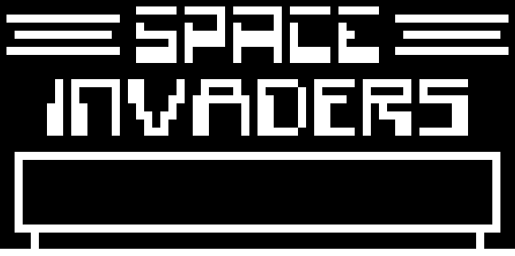

# CHIP-8 Emulator Using LWJGL

## What is this?

In a nutshell, it's an emulator that can run any program written in the CHIP-8 programming language.

CHIP-8 is an old interpreted programming language and this emulator interprets and provides a graphical interface for CHIP-8 programs similar to the COSMAC VIP and other computers from the 70s.

### Why did I make it?

In spring 2020, I had a blast playing old games like Earthbound and Mother 3 with emulators so I decided to spend 3 months developing a basic emulator myself.

### Technologies Used

- Java (so I could conveniently submit this as a semester project and because it's easier than C++)
- LWJGL (as a wrapper for OpenGL, GLFW and other graphics related features)
- OpenGL (for graphics rendering)
- GLFW (for input and windows)
- Gradle (for sharing on github and simple building)

### Lessons learned

#### Java

Programming an interpreter for opcodes really helps you understand bitwise operations on a deeper level. Java was helpful because it has more abstraction than C++ but still allows lower level operations.  

#### LWJGL, OpenGL and GLFW

The learning curve for graphics libraries is quite high. And that is exactly why I chose to use OpenGL. Going through this effort helped strengthen my Linear Algebra, however, and I believe this has contributed to my data science work and studies.

#### Gradle

I decided to learn Gradle before Maven due to the simple syntax and helpful documentation that is available for Gradle. Once again, the learning curve here is high but I am confident that this contributes to my DevOps skills.

## How to run/build

### If you have gradle installed

Run the project using `gradle run`. You can build it using `gradle build`

### If you don't have gradle installed

Simply run `gradlew run` in a command prompt on Windows or `./gradlew run` in a UNIX-based terminal.  
If you wish to build the project, use `gradlew build` or `./gradlew build` for your respective OS.

#### Things to keep in mind

Regardless of how you run it, a file select menu should open which lets you browse and select your desired ROM. Depending on the ROM you choose, You may have to adjust the speed of the program by changing `numOps` (the number of operations per CPU cycle) in `Main.java`. By default, `numOps` is set to a frequency 10 for the game INVADERS.

## Controls

Keyboard controls

|1|2|3|4|
|---|---|---|---|
|Q|W|E|R|
|A|S|D|F|
|Z|X|C|V|

The above controls correspond to the following CHIP-8 keypad:

|1|2|3|C|
|---|---|---|---|
|4|5|6|D|
|7|8|9|E|
|A|0|B|F|

Controls may differ depending on the ROM used. For INVADERS, `Q` moves left, `E` moves right and `W` shoots.

## Future Work

- Sound (a single beep sound from a buzzer, really)
- Use function pointer implementation instead of switch-case
- Dynamically adjust frequency of cpu cycles for each ROM
- Implement Super CHIP-8 opcodes (gives us more programs to run!)  

## Credits / Resources used

How to write an emulator by Laurence Muller:  
<https://multigesture.net/articles/how-to-write-an-emulator-chip-8-interpreter/>

CHIP-8 Wikipedia page:  
<https://en.wikipedia.org/wiki/CHIP-8>

Cowgod's Chip-8 Technical Reference:  
<http://devernay.free.fr/hacks/chip8/C8TECH10.HTM>
